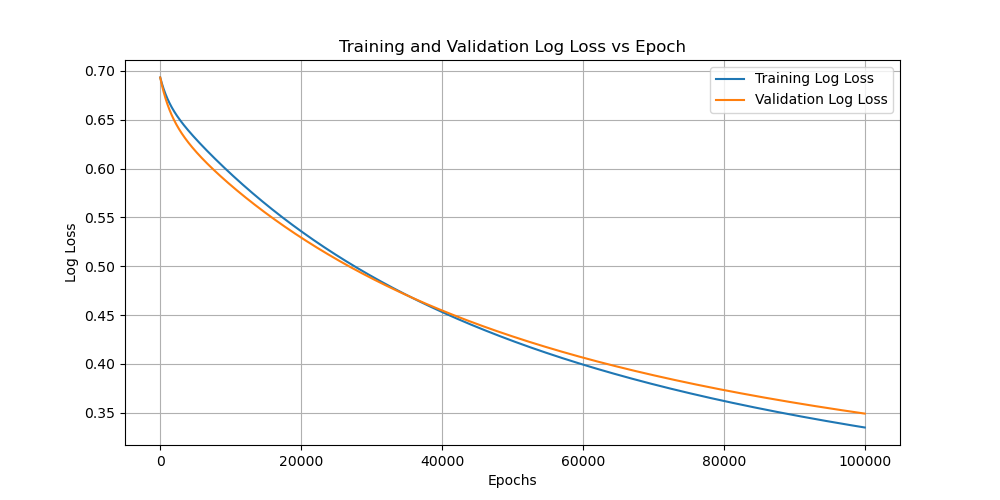

# Examples Directory

In this directory, you'll find a series of examples illustrating the application of various neural network architectures to different datasets. Each example demonstrates a unique combination of layers and loss functions to model a specific type of dataset. All models follow a general procedure where the dataset is read, shuffled, split into a 2/3 training set and a 1/3 validation set, and then a neural network is trained to minimize the chosen loss function.

The examples adhere to a naming convention that aids in identifying the model structure and the dataset used:
- The first part (e.g., `Lin`) indicates the model being used for activation
    -   **Lin**: Linear
    -   **Relu**: Rectified Linear Unit
    -   **LogSig**: Logistic Sigmoid
    -   **Soft**: Softmax
    -   **Tanh**: Tanh
 
- The second part (e.g., `SE`) indicates the objective function being used for loss
    -   **SE**: Squared Error
    -   **LL**: Log Loss
    -   **CE**: Cross Entropy

- The third part (e.g., `Med`) specifies the dataset on which the network is trained
    -   **Kid**: Kid Creative
    -   **Med**: Medical Cost Personal
    -   **MN**: MNIST Handwritten Digit

General Architecture: ``Input Layer → Fully Connected Layer → [Optional Activation Layer(s)] → Loss Layer``

## LinSEMed.py
<p align="center">
<code>Input Layer → Fully Connected Layer → Squared Error Objective Layer</code>
</p>

After training a linear regression model on the `Medical Cost` dataset with a squared error objective function and no activation layers, the process completes 100,000 epochs. The final performance, including the Root Mean Square Error (RMSE) and Symmetric Mean Absolute Percentage Error (SMAPE) for both training and validation, is printed out. These numbers tell us how well the model is doing. A plot showing how the training and validation Mean Squared Error (MSE) changes over time is also included below, giving a clear picture of the model's performance throughout the training.

### Output
```plaintext
Epoch: 100000
Final RMSE Training: 11373.330004372207
Final RMSE Validation: 11064.706089564706
Final SMAPE Training: 71.65843230171302
Final SMAPE Validation: 68.3006723871572
```
<p align="center">
  
</p>

The curves converge, suggesting that the model is learning and improving its predictions over time. The MSE plot indicates that the error has reduced significantly and stabilized, which is indicative of a good fit to the data. There is no evident overfitting as the validation error remains comparable to the training error.


## LogSigLLKid.py

<p align="center">
<code>Input Layer → Fully Connected Layer → Logistic Sigmoid Activation → Log-Loss Objective Layer</code>
</p>

This example demonstrates the training of a logistic regression model using the Kid Creative dataset to predict the likelihood of a product purchase. The neural network follows a logistic sigmoid activation layer and a log-loss objective layer. The training runs for 100,000 epochs, stopping early if the change in log loss is less than 10^-10. The accuracy of the model's predictions is a key measure of its performance, providing insight into the potential for real-world application.


### Output
```plaintext
Training Accuracy: 92.86%
Validation Accuracy: 89.78%
```
<p align="center">
  
</p>

The Log Loss plot also shows a consistent decrease in loss, which implies that the predicted probabilities are aligning closely with the actual outcomes. The closeness of the training and validation lines suggests the model is generalizing well and not just memorizing the training data.

